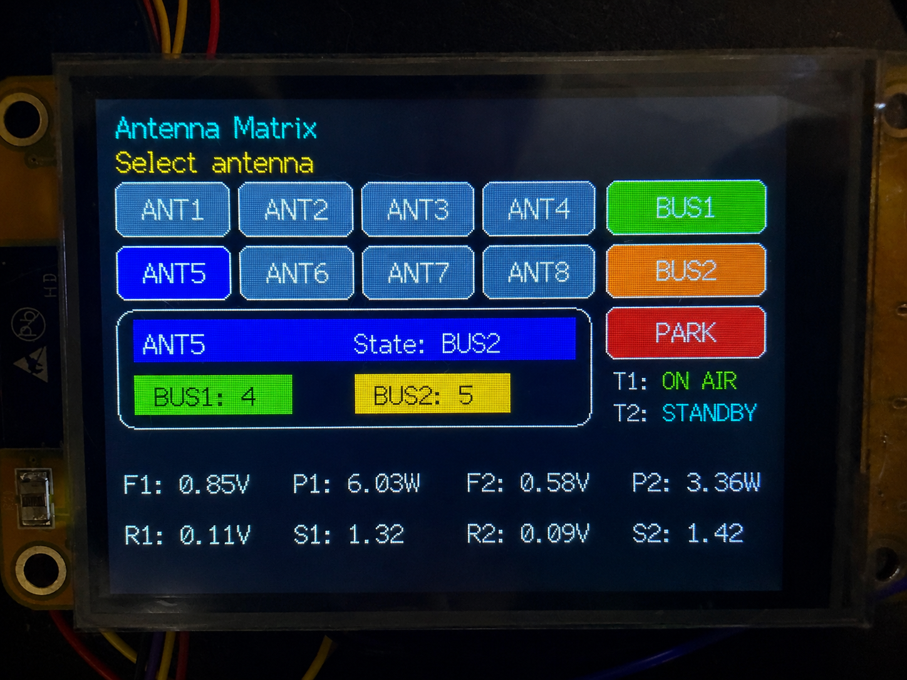
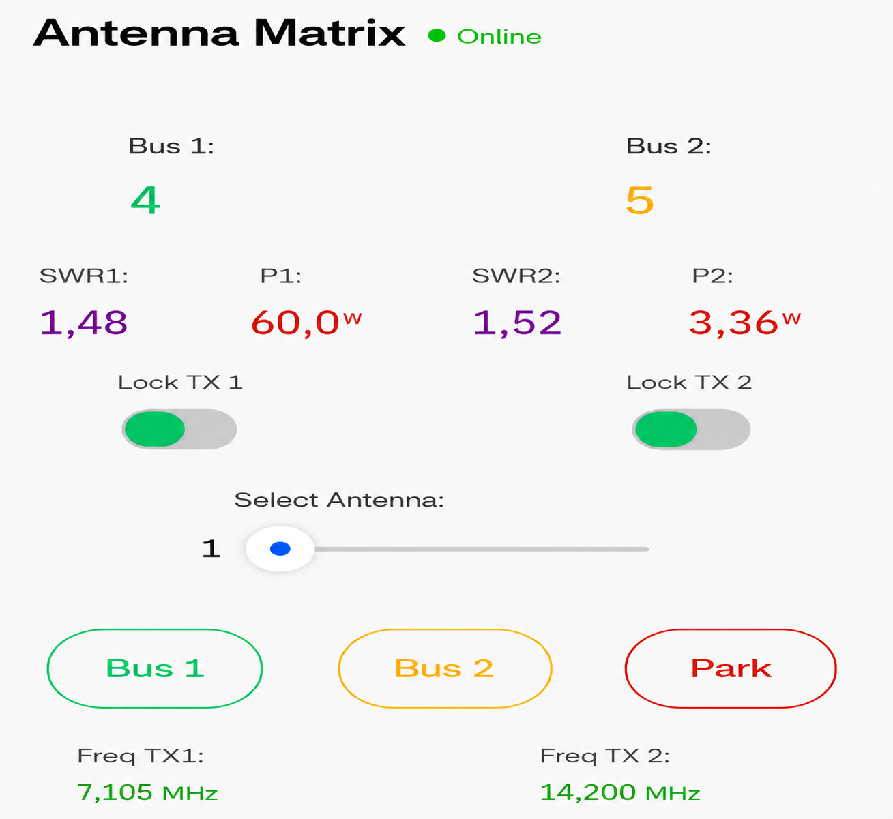
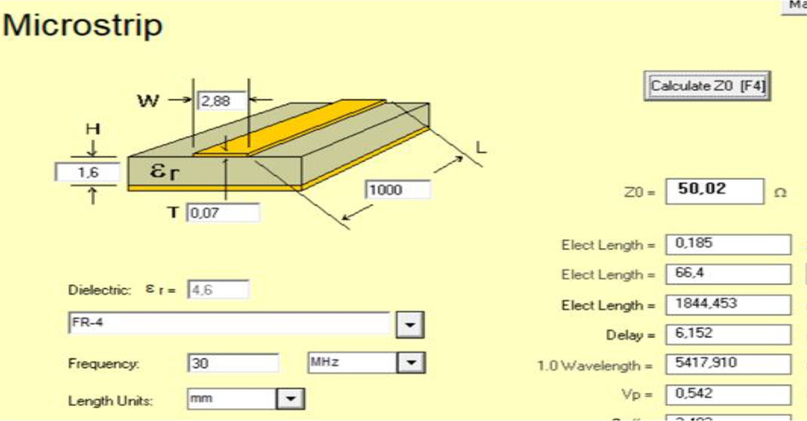
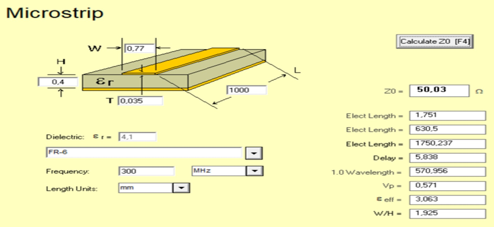
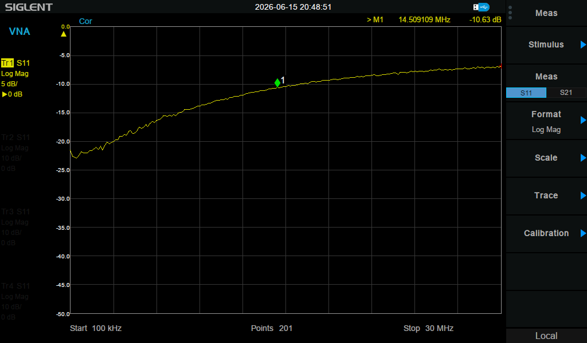
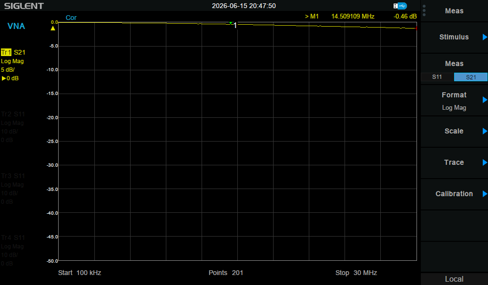
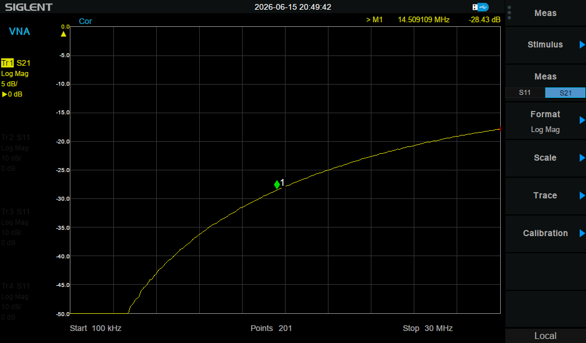
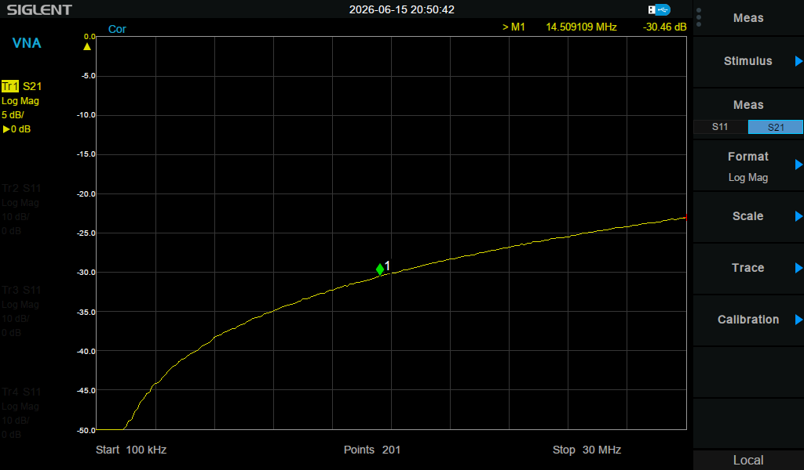

# Intelligent Remote Controlled Antenna Matrix for Shortwave Radio

## Overview

This project is a bachelor thesis project focused on the design and development of an **intelligent remote-controlled antenna matrix for shortwave radio**.

The system allows multiple HF antennas to be switched between two transceiver outputs, while providing local touchscreen control, remote control through Blynk, relay interlock protection, and RF measurement feedback such as forward power, reflected signal, SWR and frequency.

The project combines embedded hardware, RF switching, PCB design, measurement electronics, touchscreen GUI development and remote IoT control.

---

## Main Features

* 8 HF antenna inputs
* 2 HF transceiver outputs: TX1 and TX2
* PARK state for unused antennas
* Relay-based RF switching matrix
* Interlock protection to prevent unsafe relay combinations
* TX lock function to prevent switching during transmission
* Local control using CYD ESP32 touchscreen
* Remote Android control using Blynk
* Forward and reflected voltage measurement
* Estimated forward power calculation
* SWR calculation
* Frequency measurement concept using RF pickup and comparator
* 4-layer PCB design with ground reference plane
* VNA testing for matching, insertion loss, isolation and crosstalk
* Mechanical enclosure preparation for N-type RF connectors

---

## Project Goal

HF radio stations often use multiple antennas for different frequency bands or operating conditions. Manual antenna switching can be inconvenient and error-prone, especially when remote operation is required.

The goal of this project is to create a safer and smarter antenna switching system that can:

* select antennas locally or remotely
* route antennas to TX1 or TX2
* park unused antennas safely
* monitor RF conditions
* reduce the risk of wrong switching, mismatch and high SWR

---

## System Architecture

The system is built around a **CYD ESP32 touchscreen module**. The ESP32 controls the relay matrix, reads RF measurement values and communicates with the Blynk cloud for remote operation.

Basic architecture:

```text
8 HF Antennas
     |
     v
RF Relay Matrix  ---> TX1 / TX2
     |
     v
Bruene Couplers ---> Forward / Reflected Detector Voltages
     |
     v
ADS1115 ADC ---> ESP32 CYD
                  |
                  |--> Local Touchscreen GUI
                  |--> Blynk Remote Dashboard
                  |--> Relay Control via MCP23017 + ULN Drivers
```

---

## Hardware Used

Main hardware components:

* CYD ESP32 touchscreen display
* MCP23017 I/O expander
* ULN2803 relay driver stage
* ADS1115 16-bit ADC
* RF relays
* Bruene coupler circuits
* 1N5711 Schottky detector diodes
* LMV7219 comparator for frequency measurement
* N-type RF connectors
* 4-layer RF PCB
* 12 V supply with local voltage regulation

---

## Relay Control

The antenna matrix supports three main antenna states:

| State | Description              |
| ----- | ------------------------ |
| BUS1  | Antenna connected to TX1 |
| BUS2  | Antenna connected to TX2 |
| PARK  | Antenna parked/grounded  |

The firmware uses one central switching function for all control methods:

* touchscreen
* serial monitor
* Blynk remote control

This ensures that every switching request goes through the same safety logic.

### Safety Functions

* Only valid antenna states are allowed
* Existing antenna on a bus is parked before another antenna is connected
* TX1 lock blocks switching on BUS1
* TX2 lock blocks switching on BUS2
* Remote control cannot bypass the interlock logic

---

## Local Touchscreen GUI

The CYD touchscreen provides local control and monitoring.

The GUI shows:

* selected antenna
* BUS1 antenna
* BUS2 antenna
* PARK/BUS state
* TX1/TX2 lock or status
* forward voltage
* reflected voltage
* estimated power
* SWR
* frequency




---

## Blynk Remote Control

The project also includes a Blynk dashboard for remote Android control.

The Blynk dashboard can:

* select antenna number
* switch selected antenna to BUS1
* switch selected antenna to BUS2
* park selected antenna
* show BUS1 and BUS2 state
* show power and SWR values
* show TX1/TX2 frequency
* enable or disable TX locks

### Blynk Virtual Pin Mapping

| Function             | Virtual Pin |
| -------------------- | ----------- |
| Selected antenna     | V0          |
| BUS1 button          | V1          |
| BUS2 button          | V2          |
| PARK button          | V3          |
| BUS1 antenna display | V4          |
| BUS2 antenna display | V5          |
| TX1 power            | V6          |
| TX1 SWR              | V7          |
| TX2 power            | V8          |
| TX2 SWR              | V9          |
| TX1 lock             | V10         |
| TX2 lock             | V11         |
| TX1 frequency        | V12         |
| TX2 frequency        | V13         |




---

## RF Measurement Principle

The system estimates forward power and SWR using directional coupler measurements.

A Bruene coupler samples the forward and reflected RF signals. The detector circuit converts the RF samples into DC voltages. These voltages are measured by the ADS1115 and processed by the ESP32.

Measurement chain:

```text
RF Signal
   |
   v
Bruene Coupler
   |
   v
Detector Diode + RC Filter
   |
   v
ADS1115 ADC
   |
   v
ESP32 Calculation
   |
   v
CYD Display + Blynk Dashboard
```

---

## Power Calculation

The firmware estimates forward RF power using the measured forward detector voltage.

The simplified software formula is:

```text
Pline = 10 × Vforward²
```

This formula assumes:

* 50 Ω RF system
* -30 dB coupler
* detector voltage represents the sampled RF signal

Explanation:

```text
Psample = V² / (2 × 50)
Psample = V² / 100

-30 dB coupler means sampled power is 1000 times smaller

Pline = Psample × 1000
Pline = (V² / 100) × 1000
Pline = 10 × V²
```

Example:

```text
Vforward = 0.84 V

Pline = 10 × 0.84²
Pline ≈ 7.06 W
```

The power reading is an estimated value and requires final calibration using a known RF power meter and dummy load.

---

## SWR Calculation

SWR is estimated from the forward and reflected detector voltages.

The reflection coefficient is calculated from the ratio between reflected and forward voltage:

```text
Γ = sqrt(Vreflected / Vforward)
```

Then SWR is calculated as:

```text
SWR = (1 + Γ) / (1 - Γ)
```

The firmware ignores invalid SWR values when:

* forward voltage is too low
* reflected voltage is higher than forward voltage
* the detector input is floating
* no RF signal is present

This prevents misleading SWR values such as 99.90 when there is no valid RF measurement.

---

## PCB Design

The RF board was designed as a 4-layer PCB.

### Why 4 Layers?

A simple 2-layer PCB was considered, but it had several disadvantages:

* the bottom ground plane would be interrupted by many control and power traces
* RF return paths would become less predictable
* 50 Ω traces on a 2-layer 1.6 mm PCB would be much wider
* routing around relays and connectors would become more difficult
* more vias and longer routes would increase coupling and layout complexity

The 4-layer PCB allows:

* top layer for RF traces and components
* inner layer as a solid ground reference plane
* additional layers for power and control routing
* improved RF return path
* better impedance control
* reduced unwanted coupling and radiation

---

## Microstrip Design

The RF traces were designed with a 50 Ω target impedance.

An early version used a trace width calculated for a 2-layer PCB geometry. This resulted in a much wider trace of about 2.88 mm. However, the board was actually a 4-layer stackup, where the reference ground plane is much closer to the top RF trace.

This caused an impedance mismatch.

The trace width was recalculated for the 4-layer stackup:

```text
Top RF trace
0.40 mm dielectric
Inner ground plane
```

The final target microstrip width was approximately:

```text
W ≈ 0.77 mm
```

This is more suitable for the 4-layer PCB geometry.





---

## VNA Measurements

The RF path was tested using a VNA. The goal was to check matching, insertion loss, isolation and crosstalk.

### 1. Matching / Return Loss

S11 was measured to evaluate how well the selected RF path is matched to 50 Ω.

Measured result:

```text
S11 ≈ -10.63 dB at 14.5 MHz
```

This corresponds to an acceptable but not perfect match.



---

### 2. Insertion Loss

S21 was measured through the selected RF path.

Measured result:

```text
S21 ≈ -0.46 dB at 14.5 MHz
```

This shows the through-loss of the relay and microstrip path.




---

### 3. Isolation

S21 was measured between an active path and an isolated path.

Measured result:

```text
Isolation ≈ -28.43 dB at 14.5 MHz
```

This shows how much signal leaks into an isolated path.



---

### 4. Crosstalk

S21 was measured between neighbouring or unwanted RF paths.

Measured result:

```text
Crosstalk ≈ -30.46 dB at 14.5 MHz
```

This shows unwanted coupling between RF paths.




---

## VNA Measurement Summary

| Measurement    | Parameter | Result at 14.5 MHz | Meaning                        |
| -------------- | --------: | -----------------: | ------------------------------ |
| Matching       |       S11 |          -10.63 dB | Acceptable, but not perfect    |
| Insertion loss |       S21 |           -0.46 dB | Low through-loss for prototype |
| Isolation      |       S21 |          -28.43 dB | Moderate isolation             |
| Crosstalk      |       S21 |          -30.46 dB | Unwanted coupling is reduced   |

The VNA results confirm that the RF matrix is functional, but also show that the RF layout can still be improved in a future revision.

---

## Firmware

The firmware is written for the ESP32 using the Arduino framework.

Main firmware functions:

* CYD touchscreen GUI
* touch input handling
* relay matrix control
* interlock protection
* TX lock handling
* ADS1115 voltage measurement
* power calculation
* SWR calculation
* frequency counting using ESP32 PCNT
* Blynk remote control
* serial debug commands
* Wi-Fi reconnect logic

---

## Serial Commands

The firmware supports serial commands for debugging.

| Command         | Function                |
| --------------- | ----------------------- |
| `1b1 ... 8b1`   | Connect antenna to BUS1 |
| `1b2 ... 8b2`   | Connect antenna to BUS2 |
| `1p ... 8p`     | Park antenna            |
| `allp`          | Park all antennas       |
| `state`         | Print antenna states    |
| `sel1 ... sel8` | Select antenna in GUI   |
| `tx1on`         | Lock TX1 switching      |
| `tx1off`        | Unlock TX1 switching    |
| `tx2on`         | Lock TX2 switching      |
| `tx2off`        | Unlock TX2 switching    |

---

## Project Status

Completed:

* relay switching logic
* CYD touchscreen GUI
* Blynk remote control
* ADS1115 measurement integration
* power and SWR calculation
* frequency measurement concept
* 4-layer PCB design
* enclosure machining
* VNA measurements

Still to improve:

* final RF power calibration
* high-power 1 kW validation
* wider RF conductors for lower loss
* improved impedance matching
* improved isolation and crosstalk performance
* improved detector stability on all channels
* final enclosure assembly

---

## Lessons Learned

This project showed that RF PCB design requires more than simple schematic design. Important lessons were:

* RF traces need a clean and continuous return path
* PCB stackup must be known before calculating microstrip width
* 2-layer and 4-layer microstrip calculations are different
* relay selection must consider current, voltage, isolation and size
* detector outputs can float without proper pulldown resistors
* VNA measurements are essential for verifying RF performance
* local control must still work even if Wi-Fi is unavailable
* remote control should never bypass safety logic

---

## Future Work

Possible improvements for a future version:

* use wider RF conductors or copper areas for high-power paths
* improve relay transitions and connector transitions
* use controlled impedance manufacturing
* add better shielding between RF paths
* improve physical separation between high-power RF lines
* calibrate power measurement using a known RF source and dummy load
* add calibration coefficients in firmware
* improve Blynk dashboard design
* add logging of RF measurements
* perform full high-power testing

---

## Repository Structure

Suggested repository structure:

```text
Antenna-Matrix/
│
├── firmware/
│   └── antenna_matrix_esp32/
│
├── hardware/
│   ├── schematics/
│   ├── pcb/
│   └── bom/
│
├── measurements/
│   ├── vna/
│   └── screenshots/
│
├── images/
│   ├── cyd_gui.jpg
│   ├── blynk_dashboard.jpg
│   ├── pcb_layout.jpg
│   └── enclosure.jpg
│
└── README.md
```

---

## Disclaimer

This project is a prototype developed for educational purposes as part of a bachelor thesis.

The RF power and SWR measurements are estimated values and require calibration before being used as accurate measurement instruments.

The system has not yet been fully validated for continuous 1 kW RF operation. High-power RF testing should only be performed with proper equipment, dummy loads, safety precautions and supervision.

---

## Author

**Mahmoud Mostafa**
Bachelor thesis 2025/2026
Electronics-ICT — Embedded Hardware
Thomas More University of Applied Sciences
