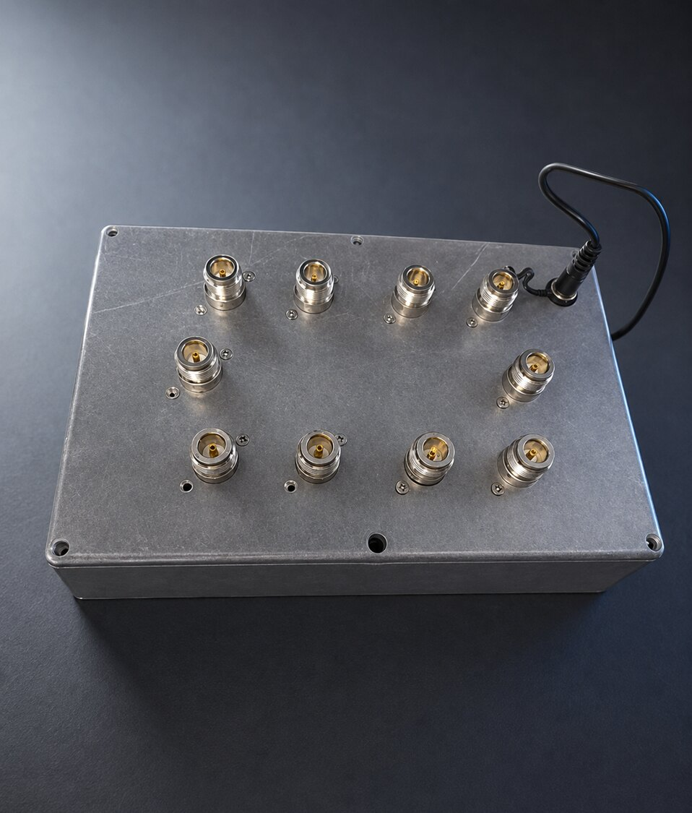
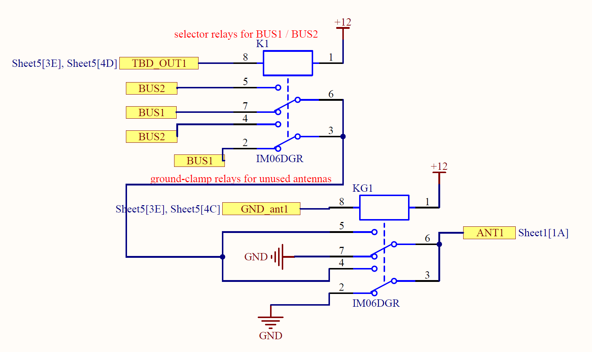
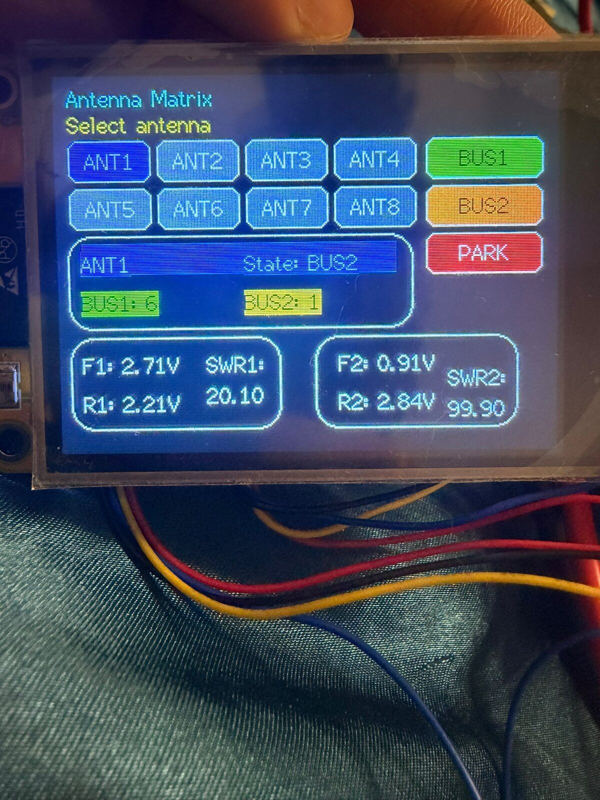
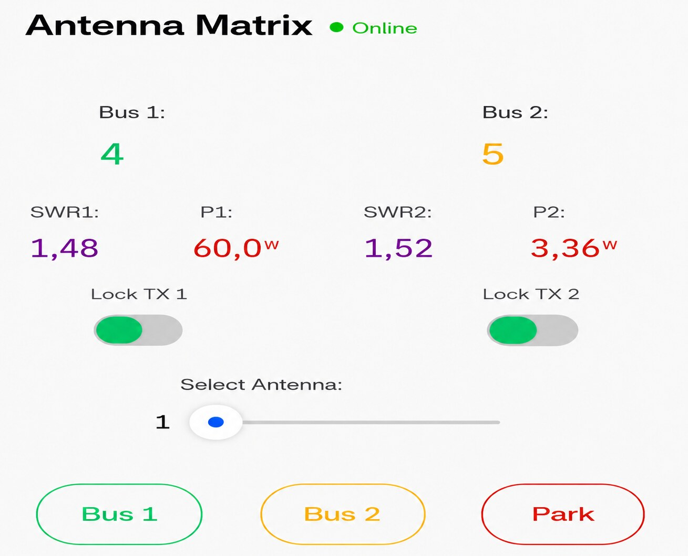
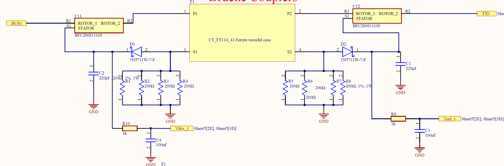
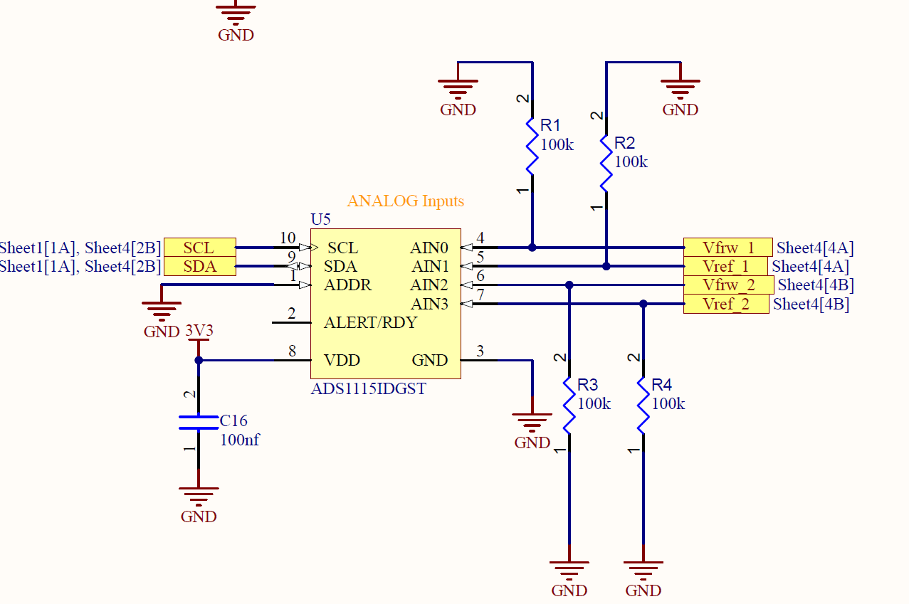
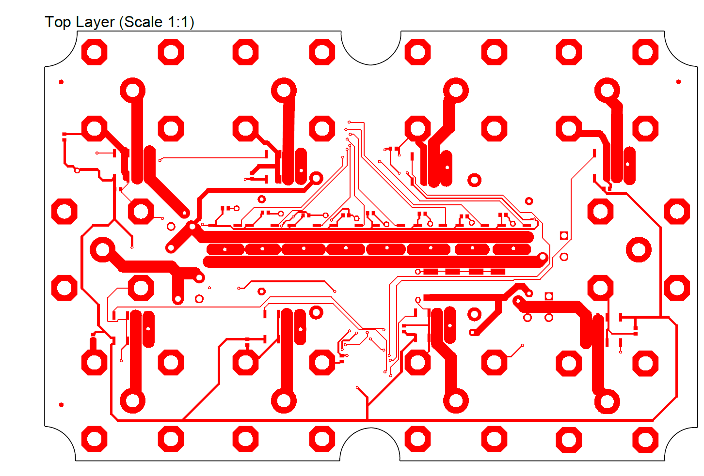
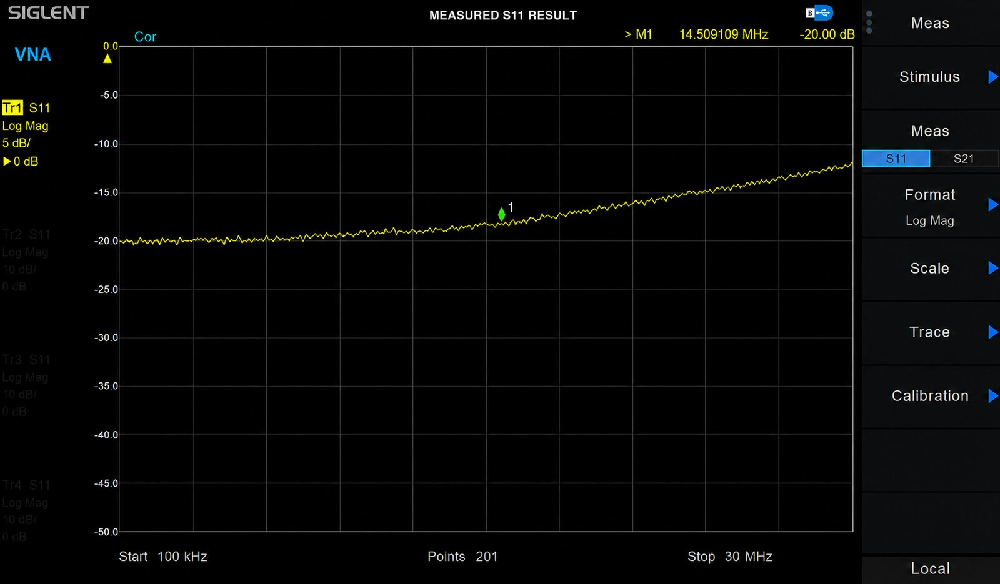
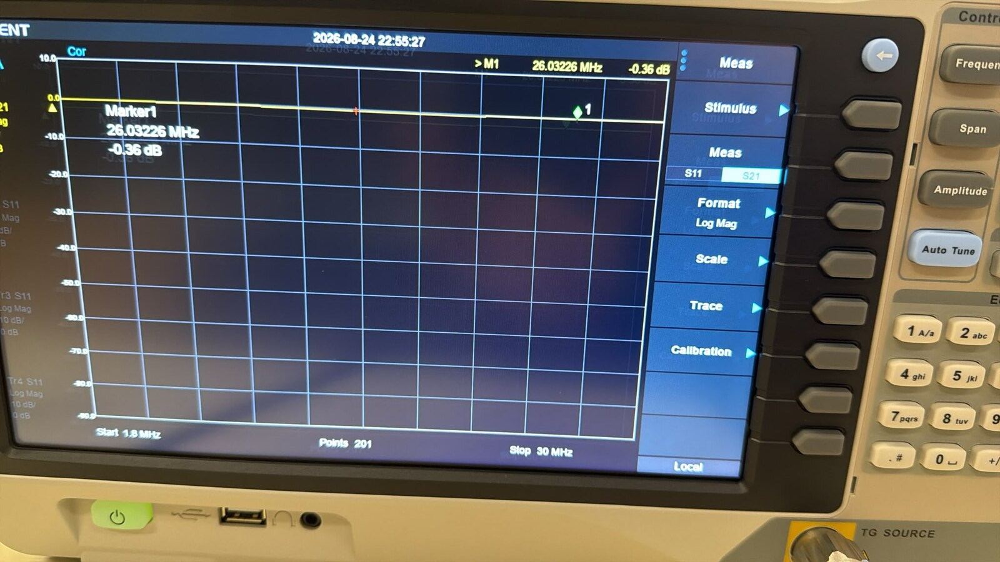
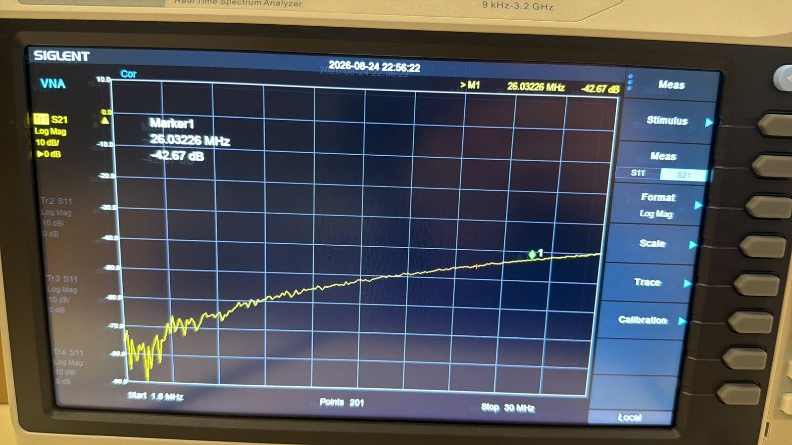

# Intelligent Remote-Controlled Antenna Matrix for Shortwave Radio

## Overview

This completed bachelor-thesis project implements an **8-to-2 remotely controlled antenna matrix for HF radio (1.8–30 MHz)**. It combines relay-based RF routing, grounded PARK states, local touchscreen control, Blynk remote control, software interlocks, watchdog supervision, and forward/reflected detector acquisition in one working prototype.

The final system switches eight antennas between two transceivers, keeps unused antennas grounded, synchronizes local and remote commands, and monitors both RF paths. The RF hardware was dimensioned around the **1 kW continuous-power design objective**, and the completed prototype was validated through functional tests and VNA measurements.



## Project Specification

The project was developed against the following requirements:

- 8 HF antenna ports and 2 transceiver ports
- operation from 1.8 to 30 MHz in a 50 Ω system
- 1 kW continuous-power design objective
- VSWR ≤ 1.10 and insertion loss ≤ 0.20 dB targets
- forward and reflected power feedback for both transceivers
- local control through a CYD ESP32 touchscreen
- remote control through Blynk
- safe BUS1, BUS2, and grounded PARK states
- watchdog and interlock functions

## Final Features

- 8 antenna inputs and 2 transceiver outputs
- relay-based BUS1/BUS2 routing
- fail-safe grounded PARK state for unused antennas
- central state manager shared by touchscreen, Blynk, and serial control
- software interlocks that reject conflicting assignments
- manual TX1/TX2 locks that block switching on the corresponding bus
- local CYD ESP32 touchscreen interface
- Blynk remote dashboard with synchronized state
- two Bruene directional couplers
- four ADS1115 channels for TX1/TX2 forward and reflected detector voltages
- power estimation and SWR calculation from the forward/reflected channels
- watchdog and Wi-Fi reconnection handling
- separate RF and control PCBs in a metal enclosure

## System Architecture

```text
8 HF antennas
      |
      v
Selector + ground-clamp relay matrix ----> BUS1 / BUS2
                                               |
                                               v
                                      Bruene couplers
                                               |
                                Forward/reflected DC outputs
                                               |
                                               v
                                          ADS1115 ADC
                                               |
                                               v
                                         CYD ESP32
                                      /      |       \
                              Touchscreen  Blynk  Relay control
                                                   |
                                                   v
                                     MCP23017 + TBD62083AFWG
```

## Hardware

### RF section

- TE Connectivity Axicom IM06DGR 12 V DPDT relays
- both relay poles paralleled on each RF path to reduce effective contact resistance and share current
- separate selector and ground-clamp relay functions
- Bruene couplers with FT114-43 ferrite toroids
- adjustable capacitors for bridge balance/directivity tuning
- 1N5711W Schottky detector diodes
- N-type bulkhead connectors connected to the PCB by short coaxial pigtails
- final 2-layer, 1.6 mm FR-4 RF PCB with a continuous bottom ground reference

The IM06DGR is a practical cost/size/current compromise rather than a dedicated high-power coaxial RF relay. Paralleling its contacts does not by itself prove continuous 1 kW capability.

### Control section

- CYD ESP32-2432S028R touchscreen module
- MCP23017 I²C I/O expander
- two TBD62083AFWG low-side relay-driver arrays
- ADS1115 16-bit I²C ADC
- 12 V input with separate regulated 5 V and 3.3 V branches

## Relay Topology and Safe States

Each antenna supports three logical states:

| State | Meaning |
| --- | --- |
| `BUS1` | Antenna connected to transceiver bus 1 |
| `BUS2` | Antenna connected to transceiver bus 2 |
| `PARK` | Antenna disconnected from both buses and grounded |

The antenna is connected to the ground-clamp relay common contact. With the clamp coil off, the normally closed contact grounds the unused antenna. When the antenna is selected, the clamp releases it to the selector relay, which routes it to BUS1 or BUS2. This creates a defined grounded state when control power is absent.

All touchscreen, Blynk, and serial requests pass through the same state manager. Before actuating the relays, the firmware:

- accepts only BUS1, BUS2, or PARK assignments
- rejects conflicting antenna-to-bus combinations
- parks an existing bus assignment before connecting a replacement
- applies the manual TX1/TX2 switching locks
- keeps local and remote state displays synchronized

The final design uses explicit TX1/TX2 locks so the operator can block relay changes on either active transceiver bus.



## Local and Remote Interfaces

The CYD touchscreen shows antenna selection, BUS1/BUS2 assignments, PARK state, manual TX locks, and detector-derived values.



The Blynk dashboard provides remote antenna commands and synchronized system status. Remote commands cannot bypass the central interlock logic.



### Blynk Virtual Pins

| Function | Virtual pin |
| --- | ---: |
| Selected antenna | V0 |
| BUS1 command | V1 |
| BUS2 command | V2 |
| PARK command | V3 |
| BUS1 antenna display | V4 |
| BUS2 antenna display | V5 |
| TX1 power estimate | V6 |
| TX1 SWR estimate | V7 |
| TX2 power estimate | V8 |
| TX2 SWR estimate | V9 |
| TX1 manual lock | V10 |
| TX2 manual lock | V11 |

## Forward/Reflected Measurement

Each transceiver path contains a Bruene coupler. The current transformer samples line current, while the capacitive network samples line voltage. Combining these components produces outputs corresponding to the forward and reflected waves. The 1N5711W detector stages convert the RF samples into DC voltages, and the ADS1115 digitizes four channels:



- TX1 forward
- TX1 reflected
- TX2 forward
- TX2 reflected

The four channels were acquired independently and produced stable readings during bench testing.



### Power and SWR Processing

The firmware converts the detector voltages into power and SWR values. The conversion is based on the 50 Ω RF system and the coupler response; calibration coefficients allow the two measurement channels to be matched to a reference meter.

SWR is derived from the forward/reflected relationship:

```text
|Γ| = sqrt(Preflected / Pforward)
SWR = (1 + |Γ|) / (1 - |Γ|)
```

If calibrated detector outputs are proportional to RF voltage rather than power, the corresponding calibrated voltage ratio is used directly for `|Γ|`. The firmware rejects invalid cases such as insufficient forward signal or reflected values outside the valid calibrated range.

The acquisition, processing, display, and Blynk reporting chain is fully integrated in the final system. Absolute wattmeter accuracy depends on the calibration coefficients used for the individual couplers.

## RF PCB and 50 Ω Microstrip

An earlier RF-board revision used a 4-layer stack-up with the reference plane close to the top layer. Its calculated 50 Ω trace width was approximately 0.77 mm. Although theoretically impedance-controlled, the narrow conductor and discontinuities around relay and connector transitions were not suitable for the intended high-power prototype.

The final RF board uses:

- 2-layer, 1.6 mm FR-4 construction
- RF routing on the top layer
- a continuous ground reference on the bottom layer
- approximately 2.9 mm microstrip width from the fabricated stack-up calculation (about 50.16 Ω at 30 MHz)
- ground-via stitching and improved connector/relay transitions



## RF Validation

Measurements were made over the HF range with a calibrated VNA and 50 Ω terminations. The results confirm that the final RF board provides a matched, low-loss through-path with strong isolation between inactive paths.

### Return Loss (S11)

The final 2-layer board measured approximately:

- **S11 ≈ −20 dB below 15 MHz**
- **S11 ≈ −13 dB at 30 MHz**
- corresponding VSWR range of approximately **1.22 to 1.58**

This is a clear improvement over the earlier 4-layer board, which measured −10.63 dB at 14.5 MHz and degraded toward approximately −7 dB at 30 MHz.



### Insertion Loss (S21)

The latest validated marker is:

- **S21 ≈ −0.36 dB at 26 MHz**, equivalent to **0.36 dB insertion loss**



### Isolation (S21)

The latest validated marker is:

- **S21 ≈ −42 dB at 26 MHz**, equivalent to **42 dB isolation**



### Validated Measurement Summary

| Measurement | Latest validated result | Scope |
| --- | ---: | --- |
| Return loss | S11 ≈ −20 dB below 15 MHz; ≈ −13 dB at 30 MHz | Final 2-layer board |
| Insertion loss | S21 ≈ −0.36 dB at 26 MHz | Selected through-path |
| Isolation | S21 ≈ −42 dB at 26 MHz | Selected isolated path |

## Firmware

The ESP32 firmware uses the Arduino framework and includes:

- centralized relay state management
- MCP23017 output control through TBD62083AFWG drivers
- touchscreen input and status rendering
- Blynk commands and state synchronization
- ADS1115 detector acquisition
- power and SWR processing
- manual TX locks
- serial debug commands
- watchdog supervision
- Wi-Fi/Blynk reconnection handling

### Serial Commands

| Command | Function |
| --- | --- |
| `1b1 ... 8b1` | Connect antenna to BUS1 |
| `1b2 ... 8b2` | Connect antenna to BUS2 |
| `1p ... 8p` | Park antenna |
| `allp` | Park all antennas |
| `state` | Print antenna states |
| `sel1 ... sel8` | Select antenna in the GUI |
| `tx1on` / `tx1off` | Enable/disable TX1 manual lock |
| `tx2on` / `tx2off` | Enable/disable TX2 manual lock |

## Project Completion

The final prototype is complete and operational within the bachelor-thesis scope. Completed and demonstrated functions include:

- 8-to-2 relay switching and grounded PARK behavior
- local CYD and remote Blynk control
- shared state management and software interlocks
- manual TX lock behavior
- four independent raw detector channels
- final-board S11 on a selected path
- measured S11, insertion loss, and isolation performance
- watchdog supervision and recovery
- complete two-board integration in the metal enclosure

## Lessons Learned

- The fabricated PCB stack-up must be known before calculating microstrip width.
- RF traces are transmission lines; relay and connector transitions are part of the impedance path.
- A continuous, short return path is as important as the RF trace itself.
- A theoretically correct narrow microstrip can still be a poor practical choice for high-current RF.
- Relay selection must consider mismatch current, contact resistance, RF behavior, size, and cost.
- Local and remote commands must use the same interlock logic.
- Detector calibration determines absolute wattmeter accuracy.
- Clear separation between requirements, calculations, and measured results keeps RF validation technically meaningful.

## Validation Scope

The project is a completed functional engineering prototype designed around a 1 kW continuous-RF requirement. The published RF values are the measured results obtained from the final board. High-power RF operation must always use suitable loads, shielding, test equipment, and safe operating procedures.

## Repository Files

| Area | Files |
| --- | --- |
| Final firmware | [`firmware/antenna_matrix_esp32.cpp`](firmware/antenna_matrix_esp32.cpp) |
| Final thesis | [`documentation/antenna_matrix_thesis.pdf`](documentation/antenna_matrix_thesis.pdf) |
| RF schematic and PCB print | [`hardware/schematics/rf-board-schematic.pdf`](hardware/schematics/rf-board-schematic.pdf) · [`hardware/pcb/final-rf-pcb-layouts.pdf`](hardware/pcb/final-rf-pcb-layouts.pdf) |
| Key schematic sections | [`hardware/schematics/selector-ground-clamp.png`](hardware/schematics/selector-ground-clamp.png) · [`hardware/schematics/bruene-coupler.png`](hardware/schematics/bruene-coupler.png) · [`hardware/schematics/ads1115-interface.png`](hardware/schematics/ads1115-interface.png) |

## Author

**Mahmoud Mostafa**

- Bachelor thesis 2025/2026
- Electronics-ICT — Embedded Hardware
- Thomas More University of Applied Sciences
